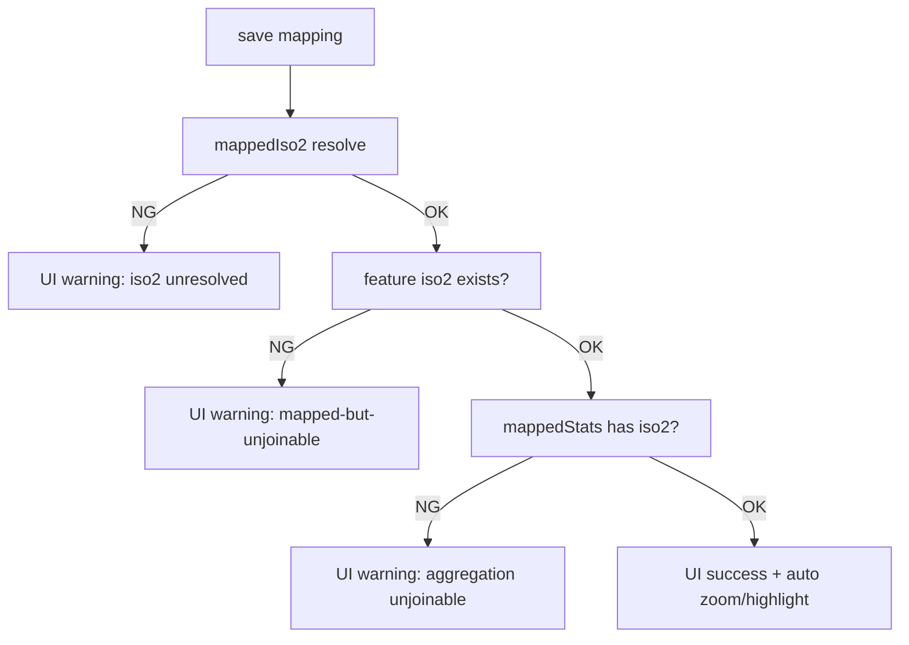

# 国マッピング基盤の再設計

## 1. データモデル図（Alias / Country / Feature Layer）

- Alias Layer: 端末保存時も読込時も同じ正規化キーを使用。
- Country Layer: token（例: `iso2_cn`）に対して canonical ISO2 を1対1で保持。
- Feature Layer: `feature.id` を最優先に ISO2 を解決し、ISO系→name系はフォールバック。

## 2. マイグレーション方針（localStorage）

1. 起動時に `coffeeCountryMapping_v2` を読込。
2. `coffeeCountryMapping_v1` が存在したら Alias/Country の2層へ自動移行。
3. 既定マッピングも同一の2層モデルでロード。
4. 変換後は `v2` で保存し、`v1` を削除。

## 3. 保存時検証フロー

## 4. 失敗ケース一覧（原因段付き）

| カテゴリ | 原因段 | 例 | 検知方法 |
|---|---|---|---|
| unmapped | alias | raw が Alias Layer 未登録 | 未マッピング一覧 |
| mapped-but-unjoinable | feature | ISO2 はあるが地図 feature が未保持 | 管理画面 `feature存在=no` |
| mapped-but-unjoinable | join | feature はあるが集計合流なし | 管理画面 `集計合流=no` |
| save-warning | iso2 | 入力値からISO2へ解決不可 | 保存直後ステータス |

## 5. 自動診断レポート（legacy ISO2含む）

- 1クリック診断で `raw -> aliasToken -> iso2 -> feature存在 -> join` をコンソール出力。
- legacy ISO2（例: `YD`）は canonical ISO2（`YE`）へ正規化。
- 失敗時は silent fail せず、UIに保存後ステータスを明示。
